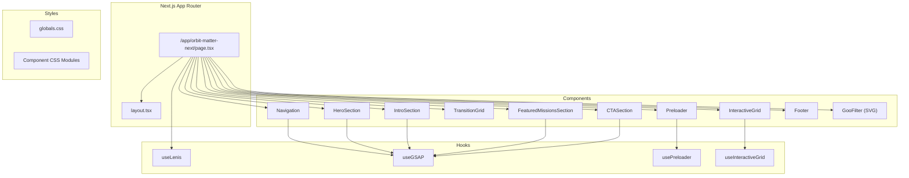

# Design Document: Orbit Matter Homepage Migration

## Overview

Миграция главной страницы Orbit Matter с ванильного HTML/CSS/JS на Next.js 14+ App Router. Проект использует TypeScript, GSAP для анимаций, Lenis для плавного скролла. Архитектура построена на компонентном подходе React с client-side анимациями.

## Architecture



## Components and Interfaces

### File Structure

```
app/orbit-matter-next/
├── page.tsx                    # Main page component
├── layout.tsx                  # Layout with metadata
├── globals.css                 # Global styles + CSS variables
├── components/
│   ├── GooFilter.tsx          # SVG filter for goo effect
│   ├── Navigation/
│   │   ├── Navigation.tsx
│   │   └── Navigation.css
│   ├── Preloader/
│   │   ├── Preloader.tsx
│   │   └── Preloader.css
│   ├── InteractiveGrid/
│   │   ├── InteractiveGrid.tsx
│   │   └── InteractiveGrid.css
│   ├── TransitionGrid/
│   │   ├── TransitionGrid.tsx
│   │   └── TransitionGrid.css
│   ├── HeroSection/
│   │   ├── HeroSection.tsx
│   │   └── HeroSection.css
│   ├── IntroSection/
│   │   ├── IntroSection.tsx
│   │   └── IntroSection.css
│   ├── FeaturedMissionsSection/
│   │   ├── FeaturedMissionsSection.tsx
│   │   └── FeaturedMissionsSection.css
│   ├── CTASection/
│   │   ├── CTASection.tsx
│   │   └── CTASection.css
│   └── Footer/
│       ├── Footer.tsx
│       └── Footer.css
├── hooks/
│   ├── useLenis.ts            # Lenis smooth scroll hook
│   ├── useGSAP.ts             # GSAP initialization hook
│   ├── usePreloader.ts        # Preloader state management
│   └── useInteractiveGrid.ts  # Grid interaction logic
└── utils/
    ├── animations.ts          # Animation utilities
    └── constants.ts           # Shared constants
```

### Component Interfaces

```typescript
// GooFilter.tsx
interface GooFilterProps {}

// Navigation.tsx
interface NavigationProps {
  links: NavLink[];
}

interface NavLink {
  href: string;
  label: string;
}

// Preloader.tsx
interface PreloaderProps {
  onComplete: () => void;
}

// InteractiveGrid.tsx
interface InteractiveGridProps {
  blockSize?: number;
  highlightDuration?: number;
}

// TransitionGrid.tsx
interface TransitionGridProps {
  blockSize?: number;
}

// HeroSection.tsx
interface HeroSectionProps {
  title: string;
  subtitle: string;
  imageSrc: string;
  callouts: string[];
}

// IntroSection.tsx
interface Stat {
  label: string;
  value: string;
}

interface IntroSectionProps {
  stats: Stat[];
  heading: string;
  bodyCopy: string;
}

// FeaturedMissionsSection.tsx
interface Mission {
  id: string;
  number: string;
  title: string;
  imageSrc: string;
  tag: string;
  href: string;
}

interface FeaturedMissionsSectionProps {
  heading: string;
  missions: Mission[];
}

// CTASection.tsx
interface CTACard {
  imageSrc: string;
  alt: string;
}

interface CTASectionProps {
  logoSrc: string;
  bodyCopy: string;
  buttonText: string;
  buttonHref: string;
  cards: CTACard[][];
}

// Footer.tsx
interface SocialLink {
  label: string;
  href: string;
}

interface FooterProps {
  heading: string;
  bodyCopy: string;
  socialLinks: SocialLink[];
  copyright: string;
}
```

### Custom Hooks

```typescript
// useLenis.ts
interface UseLenisOptions {
  duration?: number;
  lerp?: number;
  smoothWheel?: boolean;
  syncTouch?: boolean;
  touchMultiplier?: number;
}

interface UseLenisReturn {
  lenis: Lenis | null;
  start: () => void;
  stop: () => void;
}

function useLenis(options?: UseLenisOptions): UseLenisReturn;

// usePreloader.ts
interface UsePreloaderReturn {
  isVisible: boolean;
  hasSeenPreloader: boolean;
  markAsSeen: () => void;
}

function usePreloader(): UsePreloaderReturn;

// useInteractiveGrid.ts
interface GridBlock {
  element: HTMLDivElement;
  x: number;
  y: number;
  gridX: number;
  gridY: number;
  highlightEndTime: number;
}

interface UseInteractiveGridOptions {
  blockSize: number;
  highlightDuration: number;
  highlightRadius: number;
}

function useInteractiveGrid(
  containerRef: RefObject<HTMLDivElement>,
  options: UseInteractiveGridOptions
): void;
```

## Data Models

### Constants

```typescript
// constants.ts
export const GRID_BLOCK_SIZE = 60;
export const GRID_HIGHLIGHT_DURATION = 300;
export const GRID_HIGHLIGHT_RADIUS = GRID_BLOCK_SIZE * 2;

export const LENIS_CONFIG = {
  desktop: {
    duration: 1.2,
    lerp: 0.1,
  },
  mobile: {
    duration: 0.8,
    lerp: 0.075,
  },
  breakpoint: 1000,
};

export const PRELOADER_DELAY = 1.75; // seconds before fade out

export const CSS_VARIABLES = {
  base100: '#f2eeda',
  base200: '#8c8a7f',
  base300: '#262626',
  base400: '#141414',
  base500: '#ee6436',
};
```

### Page Data

```typescript
// pageData.ts
export const NAV_LINKS: NavLink[] = [
  { href: '/', label: 'Index' },
  { href: '/observatory', label: 'Observatory' },
  { href: '/expedition', label: 'Expedition' },
  { href: '/traces', label: 'Traces' },
  { href: '/contact', label: 'Contact' },
];

export const STATS: Stat[] = [
  { label: 'Worlds Observed', value: '12' },
  { label: 'Recovered Fragments', value: '64' },
  { label: 'Signal Events', value: '23' },
  { label: 'Active Units', value: '09' },
];

export const MISSIONS: Mission[] = [
  { id: '1', number: '01 / 05', title: 'Solar Ridge', imageSrc: '/index/highlight_img_01.jpg', tag: '[ Field Report ]', href: '/expedition' },
  { id: '2', number: '02 / 05', title: 'Crystalline Basin', imageSrc: '/index/highlight_img_02.jpg', tag: '[ Surface Record ]', href: '/expedition' },
  { id: '3', number: '03 / 05', title: 'Luminar Signal', imageSrc: '/index/highlight_img_03.jpg', tag: '[ Signal Study ]', href: '/expedition' },
  { id: '4', number: '04 / 05', title: 'Valley Structures', imageSrc: '/index/highlight_img_04.jpg', tag: '[ Structure Log ]', href: '/expedition' },
  { id: '5', number: '05 / 05', title: 'Emerald Horizon', imageSrc: '/index/highlight_img_05.jpg', tag: '[ Horizon Scan ]', href: '/expedition' },
];

export const CTA_CARDS: CTACard[][] = [
  [{ imageSrc: '/index/cta_img_01.jpg', alt: '' }, { imageSrc: '/index/cta_img_02.jpg', alt: '' }],
  [{ imageSrc: '/index/cta_img_03.jpg', alt: '' }, { imageSrc: '/index/cta_img_04.jpg', alt: '' }],
  [{ imageSrc: '/index/cta_img_05.jpg', alt: '' }, { imageSrc: '/index/cta_img_06.jpg', alt: '' }],
];

export const SOCIAL_LINKS: SocialLink[] = [
  { label: '[ Instagram ]', href: '/contact' },
  { label: '[ YouTube Signals ]', href: '/contact' },
  { label: '[ Twitter ]', href: '/contact' },
  { label: '[ LinkedIn ]', href: '/contact' },
  { label: '[ GitHub Repository ]', href: '/contact' },
  { label: '[ Discord Hub ]', href: '/contact' },
  { label: '[ Dribbble ]', href: '/contact' },
  { label: '[ Behance Archive ]', href: '/contact' },
  { label: '[ Homebase ]', href: '/contact' },
];
```

## Animation System Design

### GSAP Integration

```typescript
// animations.ts
import gsap from 'gsap';
import { ScrollTrigger } from 'gsap/ScrollTrigger';
import { SplitText } from 'gsap/SplitText';

// Register plugins once
if (typeof window !== 'undefined') {
  gsap.registerPlugin(ScrollTrigger, SplitText);
}

// Slide animation for text
export function createSlideAnimation(
  element: HTMLElement,
  options: {
    delay?: number;
    stagger?: number;
    onScroll?: boolean;
    scrollTrigger?: HTMLElement;
  }
): gsap.core.Timeline;

// Flicker animation for text
export function createFlickerAnimation(
  element: HTMLElement,
  options: {
    delay?: number;
    onScroll?: boolean;
    scrollTrigger?: HTMLElement;
  }
): gsap.core.Timeline;

// Text fill animation (intro section)
export function createTextFillAnimation(
  element: HTMLElement,
  scrollTriggerConfig: ScrollTrigger.Vars
): ScrollTrigger;

// Sticky header animation
export function createStickyAnimation(
  trigger: HTMLElement,
  endTrigger: HTMLElement
): ScrollTrigger;

// CTA cards parallax animation
export function createParallaxCardsAnimation(
  rows: HTMLElement[],
  config: {
    leftXValues: number[];
    rightXValues: number[];
    leftRotationValues: number[];
    rightRotationValues: number[];
    yValues: number[];
  }
): ScrollTrigger[];
```

### Animation Timing

```
Page Load Timeline:
├── 0.0s: Page renders (hidden by preloader)
├── 0.0s: Preloader animation starts (rings spinning)
├── 1.75s: Preloader fade out begins
├── 2.25s: Preloader complete, content visible
├── 2.6s: Hero title slide animation
├── 2.75s: Hero body copy slide animation
├── 2.85s: Hero callout flicker animation
├── 3.0s: Hero timer flicker animation
└── Scroll: Remaining animations triggered
```

## Correctness Properties

*A property is a characteristic or behavior that should hold true across all valid executions of a system-essentially, a formal statement about what the system should do. Properties serve as the bridge between human-readable specifications and machine-verifiable correctness guarantees.*

### Property 1: Preloader Session State Consistency

*For any* page load, if sessionStorage contains "preloaderSeen" = "true", then the preloader component should not render and Lenis scroll should be immediately enabled.

**Validates: Requirements 4.6, 4.7, 4.8**

### Property 2: Interactive Grid Block Coverage

*For any* viewport dimensions, the interactive grid should create enough blocks to cover the entire viewport with no gaps, where block count = ceil(width/60) * ceil(height/60).

**Validates: Requirements 5.2**

### Property 3: Grid Highlight Timing

*For any* highlighted block, after exactly 300ms the highlight class should be removed, ensuring no blocks remain highlighted indefinitely.

**Validates: Requirements 5.5**

### Property 4: Navigation Mobile State

*For any* viewport resize event, if the new width > 1000px, the navigation should not have the "nav-open" class, regardless of previous state.

**Validates: Requirements 3.5**

### Property 5: Hero Timer Format

*For any* time value, the hero timer should display in format "Zone XX __ HH:MM" where XX is a two-digit sector (01-06) and HH:MM is Toronto timezone.

**Validates: Requirements 6.2**

### Property 6: Intro Text Fill Progress

*For any* scroll position within the intro section, the number of colored characters should equal floor(scrollProgress * totalCharacters), ensuring smooth progressive fill.

**Validates: Requirements 7.4**

### Property 7: Page Transition Link Filtering

*For any* clicked link, the page transition should only trigger if the link is internal, not a hash link, not external (http/mailto/tel), and not pointing to the current page.

**Validates: Requirements 12.5**

### Property 8: Animation Delay Adjustment

*For any* animated element within the hero section, if the preloader is showing, the animation delay should be increased by exactly 2 seconds.

**Validates: Requirements 6.7, 13.4**

## Error Handling

### Client-Side Errors

| Error Scenario | Handling Strategy |
|----------------|-------------------|
| GSAP not loaded | Check `typeof window !== 'undefined'` before registering plugins |
| sessionStorage unavailable | Wrap in try-catch, default to showing preloader |
| Font loading failure | Use `document.fonts.ready` with timeout fallback |
| Resize during animation | Debounce resize handlers, use `ScrollTrigger.refresh()` |
| Missing DOM elements | Null checks before animation initialization |

### Graceful Degradation

```typescript
// Example: Safe sessionStorage access
function getSessionValue(key: string, defaultValue: string): string {
  try {
    return sessionStorage.getItem(key) ?? defaultValue;
  } catch {
    return defaultValue;
  }
}

// Example: Safe animation initialization
function initAnimation(element: HTMLElement | null) {
  if (!element || typeof window === 'undefined') return;
  // ... animation code
}
```

## Testing Strategy

### Unit Tests

Unit tests verify specific examples and edge cases:

- Component rendering with various props
- Hook state management
- Utility function outputs
- CSS class application logic

### Property-Based Tests

Property tests verify universal properties across all inputs:

- **Preloader state**: Generate random session states, verify correct visibility
- **Grid calculations**: Generate random viewport sizes, verify block coverage
- **Timer formatting**: Generate random timestamps, verify format consistency
- **Link filtering**: Generate random href values, verify correct transition behavior

### Testing Framework

- **Test Runner**: Vitest
- **Property Testing**: fast-check
- **Component Testing**: React Testing Library
- **Animation Testing**: Mock GSAP, verify timeline creation

### Test Configuration

```typescript
// vitest.config.ts
export default defineConfig({
  test: {
    environment: 'jsdom',
    setupFiles: ['./test/setup.ts'],
    coverage: {
      provider: 'v8',
      reporter: ['text', 'json', 'html'],
    },
  },
});
```

Each property test should run minimum 100 iterations to ensure comprehensive coverage of the input space.
